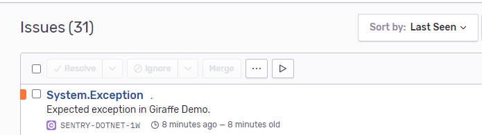
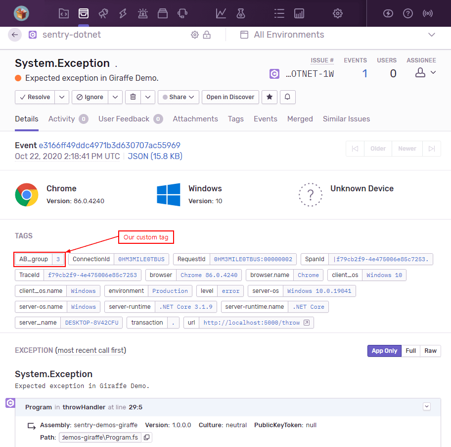
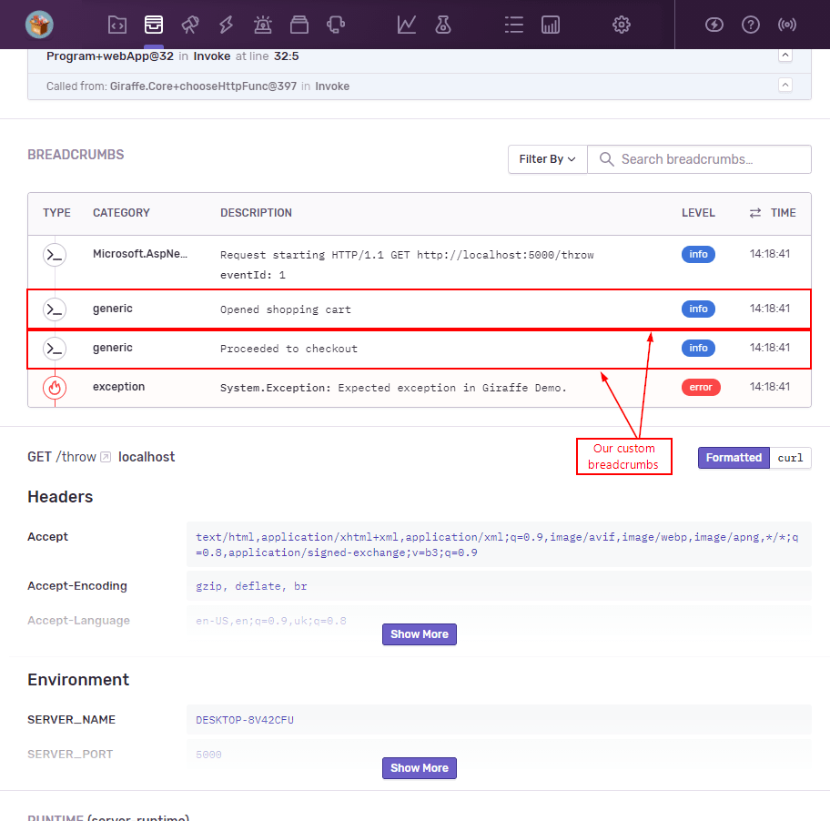

# Sentry Giraffe F# Demo

This is an example Giraffe web application that demonstrates how to integrate Sentry for error reporting.

- To install Sentry's ASP.NET Core integration, you can use [NuGet](https://www.nuget.org/packages/Sentry):

```bash
dotnet add package Sentry.AspNetCore
```

...or [Paket](https://fsprojects.github.io/Paket):

```bash
paket add Sentry.AspnetCore
```

...or add it directly into your `.fsproj` file:

```xml
<PackageReference Include="Sentry.AspnetCore" Version="3.0.0" />
```

- In order to integrate with Sentry, simply add a call to `UseSentry()` when setting up the web host:

```fsharp
[<EntryPoint>]
let main _ =
    WebHost.CreateDefaultBuilder()
        .ConfigureServices(configureServices)
        .Configure(configureApp)
        .UseSentry()
        .Build()
        .Run()
    0
```

The example in `Program.fs` showcases how Sentry can automatically catch and report unhandled exceptions and also how you can enrich sent data with additional information.
For an F# example that goes more in-depth in the Sentry SDK's API, please check out the [base F# demo](https://github.com/sentry-demos/fsharp).

## Running the demo

To run the demo, take the following steps:

0. Make sure that the latest [.NET SDK](https://dotnet.microsoft.com/download) is installed.
1. Go into `appsettings.json` and change the `Dsn` value to match your own DSN.
2. Build and run the demo with `dotnet run -c Release` (or use your IDE).
3. You should see the following debug output in the console:

```ini
  Hosting environment: Production
  Content root path: E:\Projects\Softdev\!Work\sentry-demos-giraffe
  Now listening on: http://localhost:5000
  Now listening on: https://localhost:5001
  Application started. Press Ctrl+C to shut down.
```

4. Navigate to `http://localhost:5000/throw` to throw an unhandled exception.
5. On the [sentry.io](https://sentry.io) portal, you should a new issue reported:



6. You can then inspect that issue in more detail:



